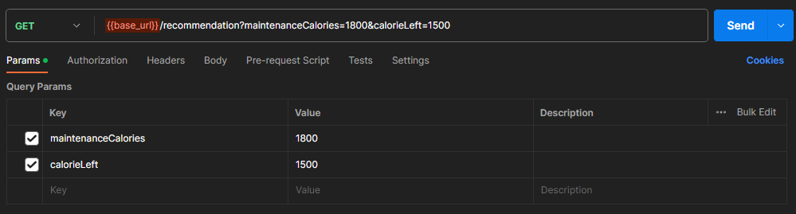
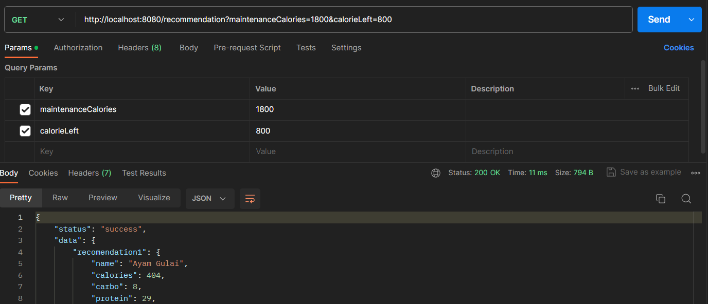

# NutriTrack Backend
This repository contain `NutriTrack` app's backend code

## How To Run
1. Download or Clone this repository
2. Open terminal
3. Go to the src
4. Install the dependencies
    ```
    npm i
    ```
5. Run the backend on your local device
    ```
    npm run dev
    ```

## How To Use
After running the backend on your local, you can run the API by referring to our [Postman API](https://www.postman.com/avionics-architect-30872526/workspace/nutritrack-capstone/request/24708904-8699bede-9098-441d-8ce0-2ef060bf4cf9) documentation by changing the `{{base_url}}` to `http://localhost:8080` and click send as shown below

### Base URL


### Local URL
